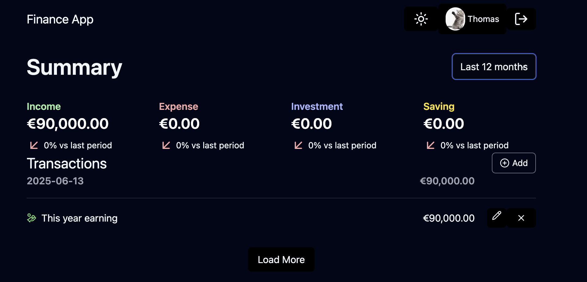
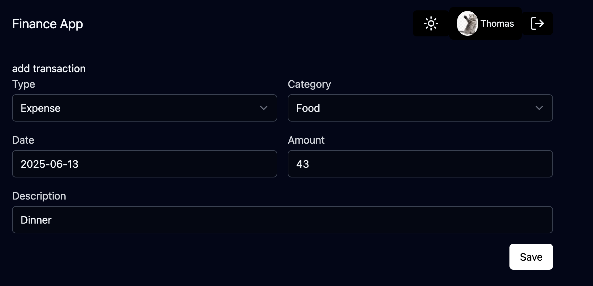
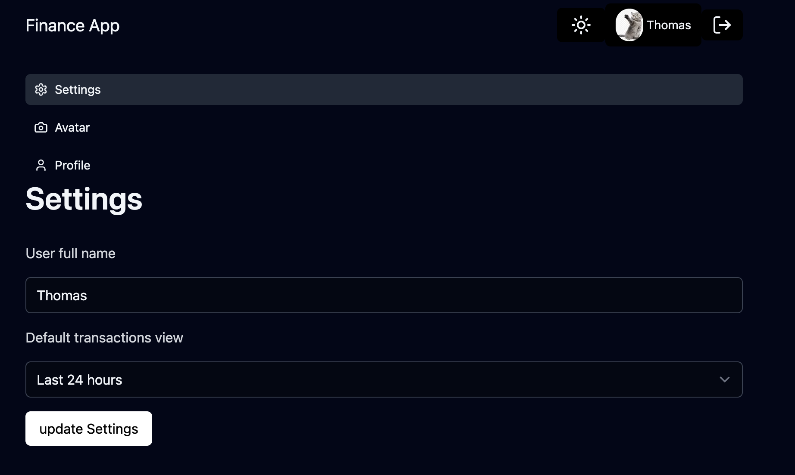

# 💰 FinanceApp

A personal finance tracker app built as part of my learning journey with **Next.js**, **Supabase**, **Tailwind CSS**, and other modern web technologies.

This project helped me understand full-stack development concepts including authentication, API integration, dynamic routing, responsive UI design, and state management.

---
## 🌐 Live Demo

Visit the deployed site here:  
👉 [https://finance-app-beta-ten.vercel.app/](https://finance-app-beta-ten.vercel.app/)

## 🧠 What I Learned

- ✅ How to structure a Next.js app using the **App Router**  
- ✅ How to integrate with **Supabase** for authentication and database  
- ✅ Using **React Hook Form** and **Zod** for form handling and validation  
- ✅ Theming with **dark mode toggle** and custom Tailwind CSS config  
- ✅ Reusable component patterns in modern React  
- ✅ Handling authentication state and protected routes  
- ✅ Deploying and testing a modern web app

---

## 🚀 Tech Stack

- **Next.js 14 (App Router)**
- **Supabase** (Auth + Realtime DB)
- **Tailwind CSS** (Styling)
- **React Hook Form** + **Zod** (Forms + Validation)
- **Lucide Icons**, **React Cookie**, and more

---

## 📦 Installation

Clone the repo:

```bash
git clone https://github.com/yourusername/finance-app.git
cd finance-app
```

Install dependencies:
```bash
npm install
```

Create a .env.local file with your Supabase credentials:
```bash
NEXT_PUBLIC_SUPABASE_URL=your-supabase-url
NEXT_PUBLIC_SUPABASE_ANON_KEY=your-anon-key
```

Start the development server:
```bash
npm run dev
```

## 🛠️ How to Use
- Create an account or log in
- Add income/expenses through the dashboard
- View analytics charts
- Toggle between light/dark mode
- View privacy policy and terms from the footer

---

## 📸 Sample Usage

Below are some screenshots showing key features of the app:

### 🔐 Login Page


### 📊 Dashboard with Analytics



### 🔄 Transaction Form



### 👤 User Setting


